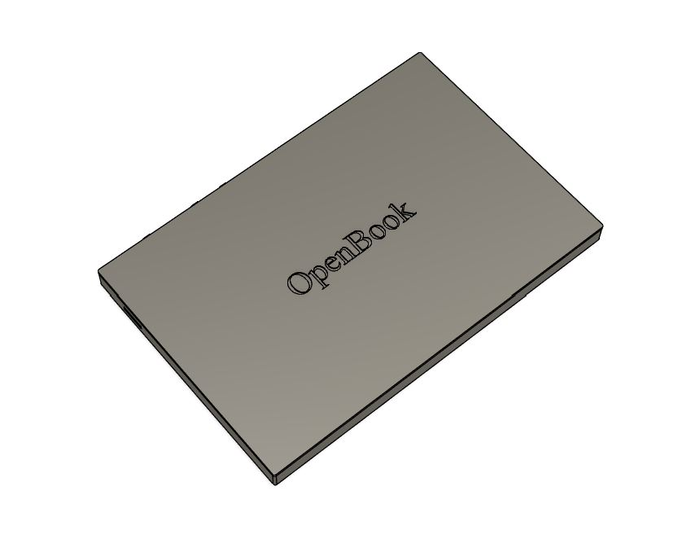
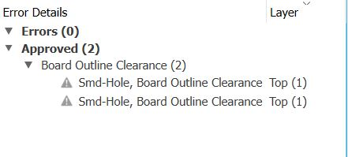

# OpenBook

## Overview

The project was carried out as part of the Computer Systems Testing course and aims to create a detailed 3D model of an E-Book Reader tablet. We worked on both the internal circuit design and the development of the device’s external appearance, using Fusion 360 software provided by Autodesk.

## Block Diagram

.png)

## Bill of Materials
| Componenta | Link | Datasheet |
|-----------|--------------|-----------|
| BUTTON | [Model](https://industry.panasonic.com/global/en/products/control/switch/light-touch/number/evqpuj02k) | [Datasheet](https://www.lcsc.com/datasheet/lcsc_datasheet_2201121800_PANASONIC-EVQPUJ02K_C2936858.pdf) |
| CAPACITOR | [Model](https://componentsearchengine.com/part-view/R0402%201%25%20100%20K%20(RC0402FR-07100KL)/YAGEO) | [Datasheet](//efaidnbmnnnibpcajpcglclefindmkaj/https://www.resistor.com/assets/pdf/0402tstd.pdf) |
| CPH3225A | [Model](https://www.snapeda.com/parts/CPH3225A/Seiko+Instruments/view-part/?ref=eda) | [Datasheet](https://octopart.com/datasheet/cph3225a-seiko-25340571) |
| EVQPUJ02K | [Model](https://industry.panasonic.com/global/en/products/control/switch/light-touch/number/evqpuj02k) | [Datasheet](https://www.lcsc.com/datasheet/lcsc_datasheet_2201121800_PANASONIC-EVQPUJ02K_C2936858.pdf) |
| KP-1608SURCK | [Model](https://www.snapeda.com/parts/KP-1608SURCK/Kingbright/view-part/?ref=search&t=LED%200603) | [Datasheet](//efaidnbmnnnibpcajpcglclefindmkaj/https://media.elv.com/file/107153_led_surck1608_data.pdf) |
| USBLC6-2SC6Y | [Model](https://www.snapeda.com/parts/USBLC6-2SC6Y/STMicroelectronics/view-part/?ref=eda) | [Datasheet](https://www.digikey.com/en/htmldatasheets/production/1375342/0/0/1/usblc6-2sc6y) |
| SD0805S020S1R0 | [Model](https://ro.mouser.com/ProductDetail/KYOCERA-AVX/SD0805S020S1R0?qs=jCA%252BPfw4LHbpkAoSnwrdjw%3D%3D) | [Datasheet](https://www.alldatasheet.com/view.jsp?Searchword=SD0805S&sField=2) |
| PGB1010603MR | [Model](https://www.snapeda.com/parts/PGB1010603MR/Littelfuse/view-part/?ref=eda) | [Datasheet](https://www.alldatasheet.com/view.jsp?Searchword=Pgb1010603mr&gad_source=1&gbraid=0AAAAADcdDU8aYfZtfJfdZ9I5j6RwZ_cbA&gclid=Cj0KCQjwqcO_BhDaARIsACz62vOPBOBe0eOh5gDUFkkKl4JBcbmoFZYtJ8BOnbaWqr_BuUCcVWvbutAaAmGkEALw_wcB) |
| BD5229G-TR  | [Model](https://componentsearchengine.com/part-view/BD5229G-TR/ROHM%20Semiconductor) | [Datasheet](https://www.lcsc.com/datasheet/lcsc_datasheet_2201131330_ROHM-Semicon-BD5229G-TR_C962636.pdf) |
| XC6220A331MR-G | [Model](https://componentsearchengine.com/part-view/XC6220A331MR-G/Torex) | [Datasheet](https://www.alldatasheet.com/view.jsp?Searchword=Xc6220&gad_source=1&gbraid=0AAAAADcdDU8aYfZtfJfdZ9I5j6RwZ_cbA&gclid=Cj0KCQjwqcO_BhDaARIsACz62vPS06NB6tLgniZzfaVpKNu1m811BNk6AEPfg4DbP6f5S8QWA_pW_UQaAv-0EALw_wcB) |
| XC6220A331MR-G | [Model](https://componentsearchengine.com/part-view/XC6220A331MR-G/Torex) | [Datasheet](https://www.alldatasheet.com/view.jsp?Searchword=Xc6220&gad_source=1&gbraid=0AAAAADcdDU8aYfZtfJfdZ9I5j6RwZ_cbA&gclid=Cj0KCQjwqcO_BhDaARIsACz62vMO5_aHsn35cIZBK6oCFuB_WOxz_zKu4yOHJ69-EnaUd5Jfas_Avm8aAuk5EALw_wcB) |
| USB4110-GF-A  | [Model](https://componentsearchengine.com/part-view/USB4110-GF-A/GCT%20(GLOBAL%20CONNECTOR%20TECHNOLOGY)) | [Datasheet](//efaidnbmnnnibpcajpcglclefindmkaj/https://gct.co/files/drawings/usb4110.pdf) |
| Adafruit | [Model](https://eu.mouser.com/ProductDetail/Adafruit/4208?qs=PzGy0jfpSMtbScLbr0L5dw%3D%3D) | [Datasheet](https://www.arrow.com/en/manufacturers/adafruit-industries/datasheets) |
| Bobina | [Model](https://store.comet.srl.ro/Catalogue/Product/43497/) | [Datasheet](https://www.scribd.com/document/814581278/Datasheet-Bobina) |
| PFMF | [Model](https://www.mouser.co.uk/ProductDetail/EPCOS-TDK/B72520T0350K062?qs=dEfas%2FXlABIszF52uu7vrg%3D%3D) | [Datasheet](https://ro.mouser.com/c/ds/circuit-protection/thermistors/resettable-fuses-pptc/?m=Schurter&series=PFMF) |
| DMG2305UX-7 | [Model](https://componentsearchengine.com/part-view/DMG2305UX-7/Diodes%20Incorporated) | [Datasheet](//efaidnbmnnnibpcajpcglclefindmkaj/https://www.mouser.com/datasheet/2/115/DMG2305UX-266242.pdf?srsltid=AfmBOop22k34YTJJra1xubiU6LPiN4M4JlcWbRoSNdxSGFak8uWgXPpK) |
| Si1308EDL-T1-GE3 | [Model](https://componentsearchengine.com/part-view/SI1308EDL-T1-GE3/Vishay) | [Datasheet](https://www.alldatasheet.com/view.jsp?Searchword=Si1308edl&gad_source=1&gbraid=0AAAAADcdDU-px713ONYSnQ2O-gcwqYcFq&gclid=Cj0KCQjwqcO_BhDaARIsACz62vN_Nz3MJOc6J_03gnVBm7aSqC8v9wyP0VD-iRKP-gFrYgdhLi99I14aAlVJEALw_wcB) |
| R0402 | [Model](https://componentsearchengine.com/part-view/R0402%201%25%20100%20K%20(RC0402FR-07100KL)/YAGEO) | [Datasheet](//efaidnbmnnnibpcajpcglclefindmkaj/https://www.resistor.com/assets/pdf/0402tstd.pdf) |
| BME680 | [Model](https://www.snapeda.com/parts/BME680/Bosch/view-part/?welcome=home) | [Datasheet](//efaidnbmnnnibpcajpcglclefindmkaj/https://www.bosch-sensortec.com/media/boschsensortec/downloads/datasheets/bst-bme680-ds001.pdf) |
| SMD Solder | [Model](https://grabcad.com/library/solder-jumpers-1) | [Datasheet]() |
| W25Q512JVEIQ | [Model](https://www.snapeda.com/parts/ESP32-C6-WROOM-1-N8/Espressif+Systems/view-part/?ref=eda) | [Datasheet](//efaidnbmnnnibpcajpcglclefindmkaj/https://www.mouser.com/datasheet/2/949/W25Q512JV_SPI_RevB_06252019_KMS-2487502.pdf?srsltid=AfmBOoquExqDVgxEELF9CzuOGxHos0CD1nQDROHD6Eebdm2foNzqozqU) |
| ESP32-C6-WROOM-1-N8 | [Model](https://www.snapeda.com/parts/ESP32-C6-WROOM-1-N8/Espressif+Systems/view-part/?ref=eda) | [Datasheet](//efaidnbmnnnibpcajpcglclefindmkaj/https://www.mouser.com/catalog/specsheets/Espressif_ESP32_C6_WROOM_1%20_Datasheet_V0.1_PRELIMINARY_en.pdf?srsltid=AfmBOooHQKNitqODRaaPjoZInfWKTacDER1t5uRK6sKqT13TrzvVo_B7) |
| DS3231SN# | [Model](https://www.snapeda.com/parts/DS3231SN%23/Analog+Devices/view-part/?ref=eda) | [Datasheet](https://www.alldatasheet.com/view.jsp?Searchword=Ds3231sn%20datasheet&gad_source=1&gbraid=0AAAAADcdDU-Gy9URfMxGmqiPg7ci5L3wR&gclid=Cj0KCQjwqcO_BhDaARIsACz62vMkK3ETSnW2w7mo0Fa-wgWJGn89AxWCyIND6k5X8MmoPl6hv6VWwT8aAiS-EALw_wcB) |
| MAX17048G+T10 | [Model](https://www.snapeda.com/parts/MAX17048G+T10/Analog+Devices/view-part/?ref=eda) | [Datasheet](https://www.alldatasheet.com/view.jsp?Searchword=Max17048&gad_source=1&gbraid=0AAAAADcdDU8aYfZtfJfdZ9I5j6RwZ_cbA&gclid=Cj0KCQjwqcO_BhDaARIsACz62vNa9xrVfzjCjADRwXD0RBbo4Nret3ywwteDGLJKZui8ZL8KdVlTE7caAvQxEALw_wcB) |
| MCP73831T-5ACI/OT | [Model](https://www.mouser.co.uk/ProductDetail/Microchip-Technology/MCP73831T-5ACI-OT?qs=hH%252BOa0VZEiAcgAcEkuamXg%3D%3D) | [Datasheet](//efaidnbmnnnibpcajpcglclefindmkaj/https://ww1.microchip.com/downloads/en/DeviceDoc/MCP73831-Family-Data-Sheet-DS20001984H.pdf) |

## Hardware Functionality
The designed circuit includes several key components that ensure the full operation of the E-Book Reader:

1. USB-C Connector with ESD Protection
  
 > Responsible for supplying power to the reader via a USB interface, while also incorporating electrostatic discharge protection to ensure safe and stable operation.
 
2. SD Card
 
 > Acts as the primary storage unit for digital books. It functions at 3.3V and interacts with the microcontroller through the SPI communication bus.
 
3. E-Paper Display and supporting modules: Drive Circuit, EPD Header, and Power Module
  
> The EPD connector interfaces with the microcontroller over SPI and links the display to the system. Power is delivered by a dedicated module that provides multiple voltage levels, while the drive circuit generates the waveforms necessary to update the E-Paper screen.
 
4. BME688 Environmental Sensor
  
 > Capable of detecting temperature, humidity, barometric pressure, and air quality. It operates at 3.3V and uses the I2C protocol for data exchange with the microcontroller.

5. DS3231SN Real-Time Clock Module (RTC)
  
 > Maintains accurate timekeeping, even during power loss, thanks to an onboard 32KHz crystal and optional battery backup. Communication is handled via the I2C protocol, connected through the SDA and SCL lines to the ESP32-C6.

6. External 64MB NOR Flash Memory
  
> Provides additional memory space beyond the microcontroller’s internal storage. Suitable for both long-term data retention and temporary caching. It communicates via SPI.

7.	LDO Voltage Regulator
  
> EStabilizes the power supply by delivering a consistent 3.3V output. Its efficiency and low power usage make it well-suited for portable, battery-operated systems.

8. Voltage Supervisor
  
> Ensures the system starts only under safe voltage conditions by continuously monitoring the power supply and blocking startup if voltage levels are insufficient or erratic.

9. Qwiic/Stemma QT Interface
  
> Simplifies sensor and peripheral integration by allowing multiple I2C devices to be linked in series, reducing the need for complex wiring and enabling plug-and-play functionality.

## Microcontroller ESP32-C6
The entire system is built around the ESP32-C6-WROOM microcontroller, a pre-assembled module with a wide range of integrated capabilities.
* The ESP-WROOM-32 board provides a variety of interfaces for connecting external sensors and components. These include I/O pins, SPI, I2C, and UART, which make it highly versatile for different types of applications. It supports Wi-Fi 6 at 2.4 GHz and features Bluetooth 5 along with a built-in antenna for reliable wireless communication.

* The microcontroller interfaces with various peripheral modules using its dedicated pins, each serving specific functions:

### Power and Reset Control
 > The 3V3 pin powers the module, and GND connects to ground. The EN pin must be set to a HIGH level to activate the module and is typically controlled by a reset button.
### USB-C Interface
 > Since the ESP32-C6 has native USB support, the device communicates directly using the USB_D+ and USB_D- lines, which are mapped to GPIO13 and GPIO14 pins. This eliminates the need for an external USB-to-serial converter.
 ### SD Card Module
> The SD card communicates with the ESP32-C6 via the SPI protocol. The necessary pins for this connection are:
GPIO27 (MISO) – data transfer from the card to the microcontroller,
GPIO7 (MOSI) – data sent to the SD card,
GPIO6 (SCK) – clock signal for synchronization,
GPIO4 (SS_SD) – chip select for the SD card.
### E-Ink Display
> The E-Paper display is connected and controlled using the following pins:
GPIO11 (EPD_CS) – chip select for the display,
GPIO5 (EPD_DC) – display control,
GPIO21 (EPD_RST) – reset pin for the display,
GPIO26 (EPD_BUSY) – pin for checking the display status.
### BME688 Environmental Sensor
> The environmental sensor uses the I2C communication protocol. The pins involved are:
GPIO19 (SDA),GPIO20 (SCL),GPIO17 (I2C_PW) – I2C power control pin.
### UART Communication
> The ESP32-C6 also supports UART communication, which is useful for debugging or connecting to other serial devices. The UART pins are:
TXD0 – data transmission,RXD0 – data reception.
### Other Important Pins
> FLASH_CS – This pin is used to select the external NOR Flash memory via the SPI protocol.
> IO/BOOT – Serves to initiate the boot mode, typically activated through a dedicated button.
> RTC_PWM – Generates Pulse Width Modulation (PWM) signals, controlling the Real-Time Clock (RTC) module's operation.
> RTC_RST – Pin responsible for resetting the RTC module, ensuring it starts from a known state.
> INT_RTC – Interrupt pin used by the RTC module, useful for triggering actions such as waking the system from sleep mode or executing periodic tasks like display updates.

## Errors
In the DRC check report, there are 4 entries marked as "Approved" and no critical errors. These are:

* 2 errors of type Board Outline Clearance: These indicate that some SMD holes are too close to the board outline. I approved them since the clearance is still acceptable for manufacturing, and the mechanical constraints of the design required this placement.
